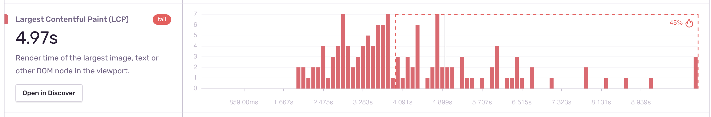
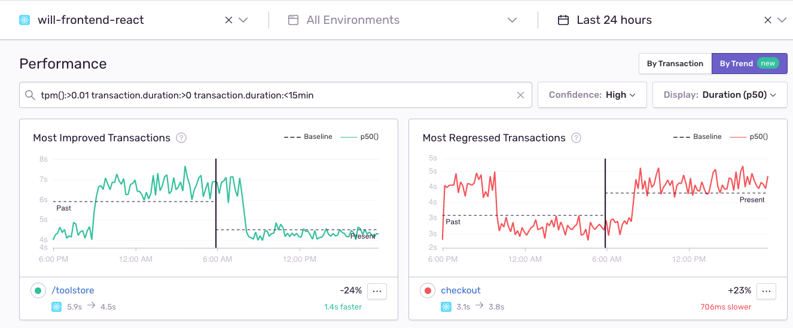

# Test Data Automation
Runs automted tests against Sentry demos on GCP, in order to generate errors and transactions to be sent to Sentry.io
TODO - Not confirmed how many events (random up to 20?) is for 1 front_end_test with -n:1 and 1 endpoint?

## Architecture
- `conftest.py` -> Sauce Labs configuration (browsers) for frontend_tests
- `backend_tests/backend_test.py` -> Hits /handled, /unhandled/, + /checkout backend demo APIs

# Tests

## FrontEnd / Selenium (`frontend_tests` directory)
Pulls up Sentry frontend in various browsers in parallel via selenium scripts.
Test case will add items to cart and then click checkout

```
pip install -r requirements.txt
py.test -s -n 2 frontend_tests
```

Pytest-xdist is used to distribute the running of selenium tests in a parallelized manner.

`-n` is for number of cores  
`-n auto` will auto set -n based on how many available cores/cpu's there are. On a 4CPU VM with -n auto set, it was observed that 4 pytest nodes were started.

https://pypi.org/project/pytest-xdist/  
https://www.tutorialspoint.com/pytest/pytest_run_tests_in_parallel.htm  
https://docs.pytest.org/en/2.1.0/xdist.html  

## Backend (`backend_tests` directory)
Hits /unhandled, /handled, + /checkout backend demo APIs
```
cd backend_tests
python backend_test.py
```
# Setup
### Python, app, environment
Python2  
Set env vars:
```
SAUCE_USERNAME  
SAUCE_ACCESS_KEY
```

If you get this error during pip install: `ERROR: Package 'setuptools' requires a different Python: 2.7.12 not in '>=3.5'` then run:
```
pip install -U pip
pip install setuptools==44.0.0

# and re-rerun:
pip install -r requirements.txt
```

Set your `DSN` and `ENV` in:
```
touch .env
```
This is so any errors occuring in conftest.py (the pytest and updates on selenium jobs) get reported.

# Run: Continuously in VM (Compute Engine)
Use an isolated VM since it's constantly occupying +2 cores simultaneously
```
source .virtualenv/bin/activate
nohup ./script.sh &

# writes stdout stderr to null, so don't end up with a nohup.out file that continues growing in size
nohup ./script.sh >/dev/null 2>&1 &
```

How to stop it
```
ps fjx
kill -9 <PID of the bash process with script.sh>
```

## Metric Alerts for Low Traffic monitoring
This is so you can monitor it's running correctly, and get notified if the job stops running.
```
event.type:transaction
transaction:get_tools # the transaction you want to monitor
function:count() over a 5 minuets window

Critical Status
Below:2
```
The average transactions per 5-minute interval should be between 50 and 200, if you're monitoring it in a Metric Alert.

## Troubleshooting
- Tests may fail if the web app's button is not availaable yet (e.g. tools didn't finish loading)
- test_add_to_cart checks to see if button is available as of 04/28/2021, so it should never fail
- Tests may still fail intermittently due to instability of connections/selenium/saucelabs/etc. 
- If the endpoints (Cloud RUn apps) being called have problems, the TDA transactions and errors will definitely reflect that
- If you're adjusting -n then you may want to update your Metric Alerts as # of events will change
- Front end apps (containers) must make requests to unique Back end apps, and not share the same back end apps, or this will skew transaction numbers in metric alerts
- Transaction volume comes from both `frontend_tests` that hit front end apps which then call their corresponding backends, as well as `backend_tests` which only hit the backend apps.
- Make sure your Metric Alerts are set the same for each project, and you're monitoring the right event type (transactions vs error)

## How to Verify Things are Are Working
#### WebVitals
Let your job run then Check LCP WebVital for one of your JS transactions:


#### Trends


## Setting up GCP cronjob to trigger simulations
**12/11/2020 Update** - This GCP cronjob is not actively being used. See Run instructions.

- `create_job.sh` -> creates GCP cron job which hits Travis requests APIs to trigger build
- `.travis.yml` -> runs automated tests / simulations

create_cron_job.sh -> GCP-cron job (runs every 20 min from midnight-6am) -> TravisCI (runs tests)

We can trigger the travis builds on a schedule via Google Cloud Scheduler cron jobs.

To register:
```
./create_cron_job.sh
```

Docs:
- https://cloud.google.com/sdk/gcloud/reference/scheduler/jobs/create/
- https://docs.travis-ci.com/user/triggering-builds/

## Additional Documentation
- https://docs.sentry.io/performance/distributed-tracing/
- https://docs.sentry.io/performance/performance-metrics/
- https://www.seleniumeasy.com/python/pytest-run-webdriver-tests-in-parallel